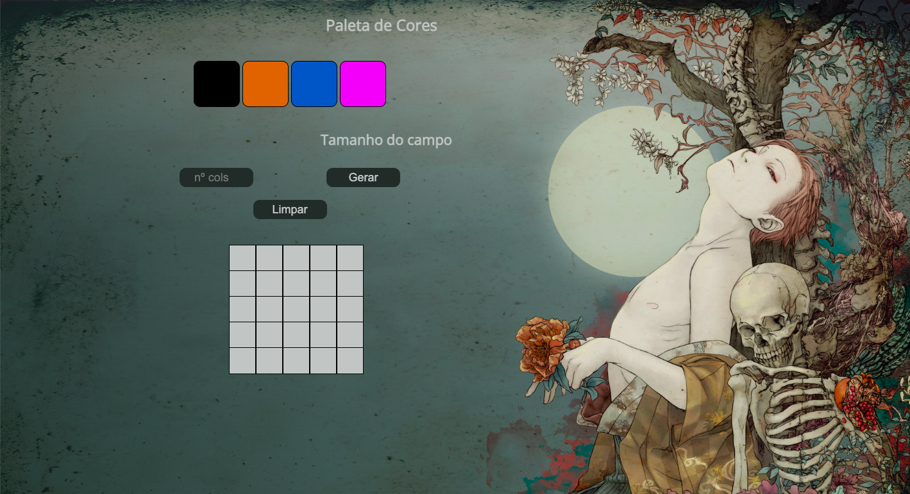

# Pixels Art Project

In this project was implemented an art editor with pixels in which the user can choose a color from a color palette and can paint whatever they want on a whiteboard. 
In this project were used:
* JavaScript
* HTML 
* CSS
 
